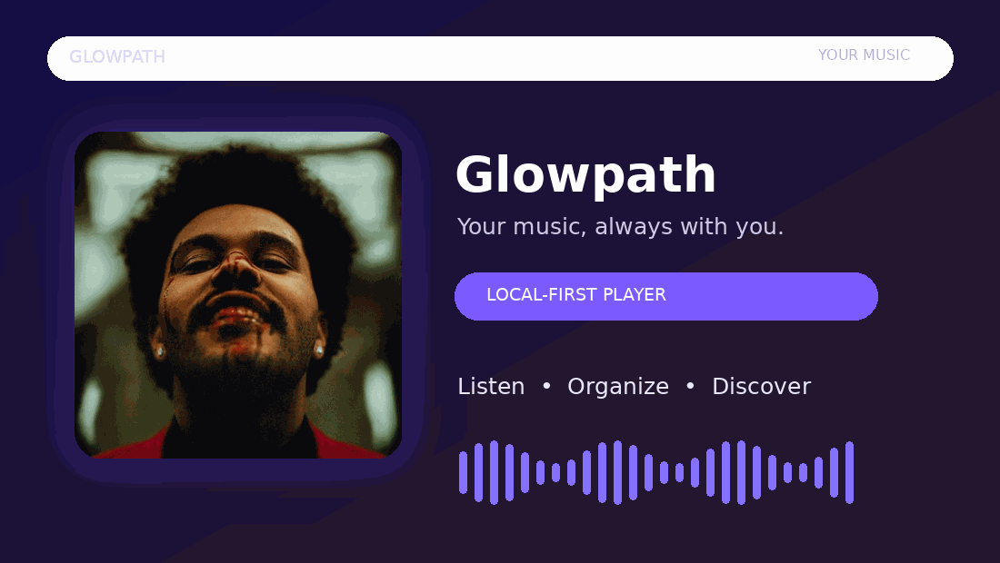
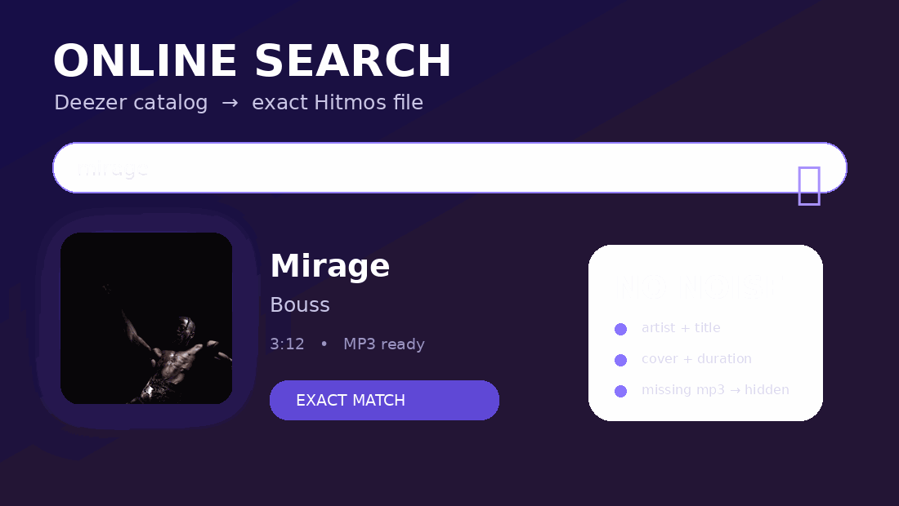
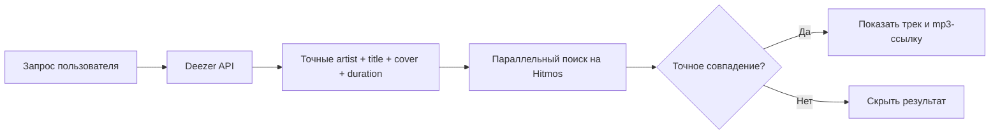

<div align="center">
  
  <h1>Glowpath</h1>
  <p><strong>Твоя музыка — всегда с тобой.</strong></p>
  <p>Современный Android-плеер на Kotlin и Jetpack Compose<br/>с локальной библиотекой и умным онлайн-поиском.</p>

  <p>
    <a href="https://github.com/qrrrv/Glowpath-app/actions/workflows/build.yml"></a>
    
    
    
  </p>
</div>

<br/>

<div align="center">
  
</div>

## О проекте

Glowpath — Android-приложение для тех, кто хочет держать музыку под рукой без перегруженного интерфейса.

- **Локальная библиотека** — слушай и организуй свои аудиофайлы.
- **Онлайн-поиск** — Deezer используется как точный музыкальный каталог.
- **Чистые результаты** — каверы, караоке и случайные совпадения отбрасываются.
- **Загрузка в библиотеку** — mp3-ссылка разрешается через Hitmos только после точного совпадения артиста и трека.
- **Material 3 UI** — плавный интерфейс на Jetpack Compose.
- **Фоновое воспроизведение** — управление из системной шторки и с медиа-кнопок.

<div align="center">
  
</div>

## Онлайн-поиск без мусора

Поиск разделён на два независимых этапа:



**Почему так:** Hitmos остаётся источником файла, но больше не определяет, какие треки показывать первыми. Deezer задаёт канонические метаданные, а Hitmos только подтверждает наличие конкретного mp3.

```text
OnlineSearchRepository
├── DeezerApi.search(query)
│   └── title, artist.name, album.cover_medium, duration
└── HitmosRepository.findExactTrack(artist, title)
    └── прямой mp3 URL или null
```

### Правило выдачи

Трек появляется в результатах только если одновременно выполнены условия:

1. Deezer вернул название и исполнителя.
2. Hitmos вернул прямую ссылку на mp3.
3. Нормализованный артист совпал полностью.
4. Нормализованное название трека совпало полностью.

Если mp3 не найден — результат не показывается. Это лучше, чем заполнять выдачу похожими каверами, караоке и случайными исполнителями.

## Технологии

| Слой | Используется |
| --- | --- |
| Язык | Kotlin 2.0.21 |
| UI | Jetpack Compose, Material 3 |
| Асинхронность | Kotlin Coroutines, `Dispatchers.IO` |
| HTML | Jsoup |
| Изображения | Coil |
| Воспроизведение | Android Media / foreground service |
| Онлайн-каталог | [Deezer Search API](https://developers.deezer.com/api/search) |
| Mp3-источник | [Hitmos](https://hitmos.me) |
| Минимальная версия | Android 8.0 / API 26 |

## Структура проекта

```text
app/src/main/java/com/musicplayer/
├── data/
│   ├── OnlineSong.kt
│   └── Song.kt
├── repository/
│   ├── OnlineSearchRepository.kt   # Deezer catalog + result resolution
│   └── HitmosRepository.kt         # Hitmos HTML/mp3 parser
├── service/
│   └── MusicService.kt             # фоновые медиаконтролы
├── ui/
│   └── screens/                    # Compose-экраны
└── viewmodel/
    └── OnlineSearchViewModel.kt    # состояния поиска и загрузок
```

Модели `OnlineSong`, `OnlineAlbumSummary` и `OnlineSearchPayload` сохранены совместимыми с существующим UI. Для нового алгоритма достаточно текущих полей: `title`, `artist`, `duration`, `downloadUrl`, `coverUrl`.

## Запуск

### Требования

- Android Studio Ladybug или новее
- JDK 17
- Android SDK 36
- Gradle wrapper из репозитория

### Сборка

```bash
git clone https://github.com/qrrrv/Glowpath-app.git
cd Glowpath-app
./gradlew assembleDebug
```

Открой проект в Android Studio, укажи Android SDK и запусти конфигурацию `app` на устройстве или эмуляторе с Android 8.0+.

> Для онлайн-поиска нужны доступ к интернету и разрешение `INTERNET`. API-ключи и OAuth не требуются.

## Ограничения онлайн-поиска

- Deezer Search API вызывается без ключа, но может быть временно недоступен или ограничен в отдельных сетях/регионах.
- За один запрос запрашивается до 10 результатов.
- Deezer не предоставляет прямой mp3-файл, поэтому загрузка зависит от доступности соответствующего трека на Hitmos.
- При недоступном Deezer приложение не подменяет каталог случайной выдачей Hitmos: результат будет пустым, а не «мусорным».
- Названия ремиксов, live-версий и альтернативных редакций считаются отдельными треками и не проходят строгую проверку, если Hitmos хранит их под другим названием.

## Проверка поиска

1. Запусти приложение.
2. Открой онлайн-поиск.
3. Введи, например, `Mirage` или имя популярного исполнителя.
4. Убедись, что в карточке отображаются обложка и длительность.
5. Проверь, что трек можно воспроизвести.
6. Запусти загрузку и убедись, что файл появляется в библиотеке.
7. Для негативной проверки используй название песни, которой нет на Hitmos: она не должна отображаться.

Для быстрой проверки Deezer из терминала:

```bash
curl 'https://api.deezer.com/search?q=mirage&limit=1'
```

## Разрешения

Приложение использует системные разрешения Android для:

- чтения локальных аудиофайлов;
- загрузки файлов в папку Music;
- фонового воспроизведения;
- сетевого онлайн-поиска;
- уведомлений о воспроизведении и загрузках.

## Статус

Проект находится в активной разработке. Основной приоритет — стабильное воспроизведение, аккуратная локальная библиотека и предсказуемый онлайн-поиск без нерелевантной выдачи.

## Лицензия и источники

Перед использованием онлайн-функций убедись, что скачивание и хранение контента разрешено законодательством твоей страны и условиями соответствующих сервисов.

- [Deezer API documentation](https://developers.deezer.com/api/search)
- [Jsoup](https://jsoup.org/)
- [Jetpack Compose](https://developer.android.com/compose)

<div align="center">
  <sub>Built with Kotlin, Compose and a little bit of glow.</sub>
</div>
